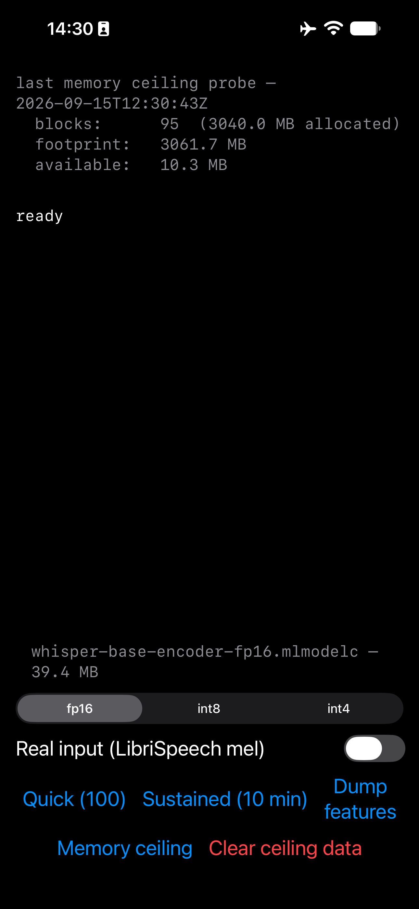

# Results

See [README.md](README.md) for what this project is and why.

Measured numbers, with the exact conditions that produced them. If a number
here can't be reproduced under the same conditions, treat it as wrong.

## Device & model

- Device: iPhone 14 Pro Max, A16 Bionic, 6GB RAM, iOS 27.0
- Model: whisper-base encoder, Core ML, fixed 30s input (`[1, 80, 3000]` mel).
  fp16 is the baseline precision throughout; int8 and int4 variants are
  also measured (sessions 5 and 7).

## Standard conditions

Unless a session notes otherwise, every run below was collected with:

- Airplane mode on
- Device off charger (not plugged in)
- Cooled 5 minutes before the run (no back-to-back thermal carryover)
- App launched fresh from the home screen (not resumed from Xcode)
- No debugger attached

Caveat: "cooled 5 minutes" is a fixed wall-clock wait, not a verified
thermal state. No session checks `thermalState` or device temperature
before starting a run, so a run could begin already partway into a
non-nominal state without anything here catching it.

Caveat: raw JSON written before `schema_version` 2 (no `schema_version`
key at all; see `RunFile` in `ios/BenchApp/BenchApp/Support.swift`) has
its `device` field and standing-conditions `notes` hardcoded as string
literals in the app, not read from the device at runtime. The two raw
`results/device-pull/*.json` files behind this document (sessions 3 and
4) predate that change. Both happen to have actually run on the iPhone
14 Pro Max named above, so their device label is correct by
coincidence, not verification, and their "airplane mode" note is an
assertion baked into that build, not a measurement. Any other
pre-`schema_version`-2 run, from any tester or device, would carry the
same hardcoded label and claim regardless of what was actually running
or what radios were on.

## Session 0: Core ML conversion

Converted the whisper-base encoder to Core ML fp16 on a MacBook M4 via
`coremltools`, verified against the PyTorch original (commit `01a840a`).

The commit log didn't record the verification numbers, so these are from
a reverification run on 2026-09-15, not the original 2026-09-04
conversion:

| Metric | Value |
|---|---|
| Output shape | (1, 1500, 512) |
| Max abs diff | 0.231567 |
| Mean abs diff | 0.002321 |
| Max rel diff | 0.009809 |

Note: `torch.jit.trace` freezes the input shape, so the converted model
accepts exactly 30s of audio and nothing else.

Caveat: verification uses a random dummy input, so these figures vary
slightly between runs. The original Sept 4 conversion is not recorded in
any file. Per this project's own conversation log (not a committed run),
it measured ~0.0083 max relative difference, consistent with the 0.009809
measured here, but that figure should be treated as anecdotal until a run
log exists for it.

## Session 1: first physical-device baseline

100 runs, airplane mode, off power (commit `005d46b`).

| Metric | Value |
|---|---|
| Load | 2046 ms |
| Steady-state median | ~42 ms |

Finding: establishes the warm-up convention used throughout this
document. Run 1 is discarded as warm-up, not more; runs 2-100 are
counted.

Caveat: no exact steady-state figure was ever recorded for this session.
This app version printed per-run timings without computing any
statistics, so ~42ms was estimated by inspection from the printed
output, not calculated. Median and percentile computation was added in
session 2.

Caveat: an earlier, non-standard-conditions measurement taken the prior
day on a charging phone read ~20% slower than this baseline.

## Session 2: memory instrumentation, cold vs. warm

`phys_footprint` sampled at 10ms intervals during inference; median/p95
computed over runs 2-100 (run 1 discarded as warm-up, per session 1).

| Metric | Cold install | Warm launch |
|---|---|---|
| Load | 1975 ms | 135 ms |
| Model cost (phys_footprint delta after load) | 8.2 MB | 2.9 MB |
| Peak footprint (during inference) | 28.4 MB | 20.6 MB |
| Median inference | 42.1 ms | 46.0 ms |
| p95 inference | 43.1 ms | 47.7 ms |

Notes:

- The `.mlpackage` is 39MB on disk but costs 6-9MB phys_footprint at load.
  Core ML memory-maps weights rather than copying them into the process's
  resident set.
- Warm model cost varies with page cache state: observed anywhere from
  0.1MB to 2.9MB across repeated warm launches, depending on how much of the
  mmap'd weight file the OS still has cached from prior runs.
- Unexplained: warm median (46.0ms) is higher than cold (42.1ms). This is
  backwards from what mmap/page-cache behavior would predict and needs
  rechecking, possibly a confound in how "warm launch" was triggered, or an
  artifact of sample size (100 runs, single session).

## Session 3: sustained run, thermal drift

Deviates from standard conditions: device was on charger (power), not off
charger. Additionally, screen was held on at minimum brightness with the
idle timer disabled for the full 600s duration of the run.

12,848 inferences over 600s, whisper-base encoder fp16, iPhone 14 Pro Max.
Raw data: `results/device-pull/sustained-1788785293.json`.

| Metric | Value |
|---|---|
| Load | 2082.9 ms |
| Model cost | 9.3 MB |
| Median (all runs) | 46.5 ms |
| p95 (all runs) | 50.1 ms |
| First-minute median | 41.8 ms |
| Last-minute median | 49.4 ms |
| Drift | +7.7 ms (+18%) |

Thermal state transitions (via `ProcessInfo.thermalState`):

| State | Onset |
|---|---|
| Nominal | 0.1 s |
| Fair | 102.4 s |
| Serious | 347.4 s |

Caveats:

- Run was on power, not battery. At the time, the assumption was that
  charging heat would pull the thermal transitions earlier than they'd
  occur on battery, making these onset times conservative (i.e.
  battery-only operation should do at least this well, possibly better).
  A battery rerun is pending. (It found the opposite: session 4 measured
  transitions arriving earlier on battery, not later. Session 8 then
  showed why the comparison didn't mean what it looked like: the actual
  latency cliff landed at ~102s in both runs regardless of power
  condition; only the reported `thermalState` timing differed.)
- The sustained summary does not discard the cold first inference the way
  the quick test does (see session 1). That inflates the first-minute
  median slightly, which means the true drift is understated relative to
  what's reported above.
- Screen was on at minimum brightness with the idle timer disabled for the
  full 600s, which contributes some heat on top of the inference workload
  itself.

### Accidental Low Power Mode measurement

Low Power Mode was on and the device was charging, not a clean isolation
of Low Power Mode alone. Needs a controlled rerun (LPM on/off, off charger,
otherwise standard conditions) before drawing conclusions.

| Metric | LPM + charging | Baseline |
|---|---|---|
| Median | 65.6 ms | 42 ms |
| Median delta | +56% | N/A |
| p95 | 85.4 ms | N/A |
| Load | 3376 ms | ~2000 ms |

## Session 4: sustained run, battery

Same protocol as session 3, but on battery (standard conditions: off
charger) instead of on power.

12,561 inferences over 600s, whisper-base encoder fp16, iPhone 14 Pro Max,
warm launch. Raw data: `results/device-pull/sustained-1788866056.json`.

| Metric | Value |
|---|---|
| Load | 137.9 ms |
| Model cost | 2.8 MB |
| Median (all runs) | 49.2 ms |
| p95 (all runs) | 50.7 ms |
| First-minute median | 41.6 ms |
| Last-minute median | 49.4 ms |
| Drift | +7.8 ms (+19%) |

Thermal state transitions (via `ProcessInfo.thermalState`):

| State | Onset |
|---|---|
| Fair | 56.2 s |
| Serious | 101.2 s |

### Comparison: session 4 (battery) vs. session 3 (power)

| Transition | Battery (session 4) | Power (session 3) |
|---|---|---|
| Fair | 56.2 s | 102.4 s |
| Serious | 101.2 s | 347.4 s |

Serious thermal state arrived 3.4x sooner on battery than on power, the
opposite of what charging heat would predict (session 3's caveats assumed
charging would pull transitions *earlier*, not later). Two candidate
explanations, both untested:

- Low battery level may make iOS more thermally conservative independent of
  actual heat (state-of-charge-driven throttling, not temperature-driven).
- The two runs may have started from different baseline temperatures
  (e.g. device history before the run, ambient conditions), confounding
  the comparison.
- Neither this run nor session 3 recorded starting battery charge level
  or ambient/device temperature, so neither hypothesis above could
  actually be tested from the data collected.

(Closed in session 8: the actual latency cliff landed at ~102s in both
runs regardless of power condition. The variance was in the reported
`thermalState`, not the hardware.)

Drift held at 18–19% across both runs (+18% on power, +19% on battery),
so the latency degradation itself is reproducible even though the thermal
transition timing is not: the two are not as tightly coupled as assumed.

The battery run also completed fewer inferences in the same 600s window
(12,561 vs. 12,848 on power), consistent with the earlier throttling
observed above.

## Session 5: precision comparison (fp16 / int8 / int4)

Quick test (100 runs), whisper-base encoder, iPhone 14 Pro Max. Airplane
mode, off power. Run 13:37–13:38.

| Metric | fp16 | int8 | int4 |
|---|---|---|---|
| Disk size | 39.4 MB | 19.8 MB | 10.0 MB |
| Load | 22.2 ms (warm) | 1425.2 ms (cold) | 1369.5 ms (cold) |
| Median inference | 41.8 ms | 41.1 ms | 40.5 ms |
| p95 inference | 43.3 ms | 42.2 ms | 41.2 ms |
| Peak footprint | 26.5 MB | 30.1 MB | 29.3 MB |

Finding: a 4x reduction in file size (fp16 → int4) buys only ~3% latency
improvement (41.8ms → 40.5ms median). At ~20M parameters the encoder is
likely compute-bound rather than memory-bandwidth-bound, so shrinking the
weights relieves no bottleneck. Practical guidance: quantize for storage
and download size, not for speed. Hypothesis to test later: this should
flip for a larger model, where memory bandwidth is more likely to be the
constraint.

Caveats:

- fp16 was measured on a warm load while int8 and int4 were cold. The run
  order was not controlled for this. Rerun all three from the same
  load state (or with cooling/reinstall between each) before trusting the
  load-time column or any cross-precision comparison that touches load.
- "Model cost" (phys_footprint delta at load: 1.6MB fp16, 7.9MB int8,
  6.9MB int4) bears no relation to file size and reflects page cache state
  rather than the model itself (see session 2). Dropped from the table
  above; report peak footprint instead.
- Conversion-time verification against PyTorch gave a max relative error of
  7.3% for int8, which exceeded the arbitrary threshold set in the
  conversion script. That threshold isn't meaningful as a correctness
  signal: the verification input was random noise, not a real spectrogram,
  and max relative difference is a worst-single-element metric that a
  handful of near-zero activations can blow up. Real accuracy numbers need
  word error rate on real audio, measured in session 7.
- Compute unit is fixed to `.all` (ANE/GPU/CPU together) in every run.
  No test here isolates which unit actually executes the quantized ops,
  so the compute-bound explanation above is inferred from the latency
  numbers, not confirmed with a layer trace (parked as future work in
  IDEAS.md).

## Session 6: input validity check (synthetic vs. real)

fp16 only, Quick test (100 runs), iPhone 14 Pro Max. Airplane mode, off
power. Both runs back to back at 10:30.

| Metric | Synthetic (`Float.random`) | Real (LibriSpeech mel, 6930-75918-0000) |
|---|---|---|
| Median | 43.0 ms | 42.9 ms |
| p95 | 44.2 ms | 43.8 ms |
| Min | 42.5 ms | 42.1 ms |
| Max | 44.8 ms | 47.1 ms |
| Peak footprint | 21.0 MB | 23.7 MB |

Finding: input distribution does not affect ANE throughput for this model.
The 0.1ms difference in median is well inside run-to-run variance. This
validates every latency number recorded since session 0: synthetic input
is a legitimate shortcut for timing work, now verified rather than assumed.

Scope the claim carefully: this holds for timing only. It says nothing
about quantization error, where activation distribution matters a great
deal. The 7.3% max relative error measured for int8 at conversion time
(session 5) used random noise and remains unverified against real audio,
settled in session 7 (aggregate WER 3.4% fp16, 3.8% int8, 8.8% int4).

Caveats:

- Tested on fp16 only, not int8 or int4.
- The real-input run showed run 1 (cold) at 69.6ms vs. 50.1ms for synthetic,
  likely first-read of the `.bin` from disk rather than inference. It's
  discarded from the statistics either way (see session 1 warm-up
  convention).
- `WhisperFeatureExtractor` pads clips shorter than 30s with silence, so if
  this utterance is short, a large fraction of the benchmarked compute was
  silence. Checked: median utterance duration was 6.27s, so 72.6% of each
  30s window was silence padding. This is why session 7 packs multiple
  utterances into each window instead, reaching 79.6% real audio.

## Session 7: quantization accuracy (WER on real audio)

Method: 20 LibriSpeech test-clean utterances packed into 7 windows of
~30s (79.6% real audio, 20.4% padding). Encoder ran on iPhone 14 Pro Max
at each precision; encoder outputs (`1, 1500, 512` float32) dumped to
disk, pulled to Mac, decoded with the full-precision PyTorch Whisper
decoder via `encoder_outputs=`. Scored with `jiwer` after normalization
(lowercase, strip punctuation, collapse whitespace, expand contractions).
Aggregate computed over total words, not averaged per window.

| Precision | Disk size | Median inference (session 5) | Aggregate WER |
|---|---|---|---|
| fp16 | 39.4 MB | 41.8 ms | 3.4% |
| int8 | 19.8 MB | 41.1 ms | 3.8% |
| int4 | 10.0 MB | 40.5 ms | 8.8% |

Per-window WER, fp16: 3.2 / 0.0 / 1.6 / 1.3 / 5.4 / 9.9 / 0.0 %.

Finding: int8 is close to free: half the size for 0.4 points of WER.
int4 is a bad trade: it buys only ~3% on latency (session 5) and costs
2.6x the error rate. On an ANE, 4-bit quantization of this model gives
up substantial accuracy in exchange for download size alone.

Caveats:

- Seven windows is a small sample, and window 5 alone was 9.9% at fp16.
  The aggregate is sensitive to individual windows. Expand to 50-100
  utterances before publishing.
- Only the encoder is quantized; the decoder ran at full precision in
  PyTorch. A fully quantized pipeline would likely be worse, so these
  numbers are optimistic relative to an on-device encoder+decoder setup.
- Packed multi-speaker windows are not standard LibriSpeech scoring, so
  absolute WER is not comparable to published Whisper figures; only the
  comparison between precisions here is valid.

## Session 8: charting the sustained runs, cliff not slope

Charted the two session 3/4 sustained runs from raw JSON.

Overlay: battery (session 4) and power (session 3) runs plotted together. Both show the same near-vertical latency step at ~102s despite different power conditions.

Session 3 (power), the on-charger run, showing the two-plateau shape.

Session 4 (battery), the off-charger run, stepping straight to one plateau.

Revised finding: the thermal degradation is a cliff, not a slope. Latency
holds flat at ~41.7ms until roughly 102 seconds, then steps near-vertically
to a plateau. The session 3/4 framing of "+18% drift over ten minutes" is
arithmetically accurate but misleading: it describes the run as a gradual
decline when the phone actually spends most of the ten minutes flat on a
plateau, with one sharp transition. Practical statement: you get about
100 seconds at full speed, then you're on a different machine.

Both runs step at almost exactly 102s despite different power conditions
(battery vs. on-charger), so the cliff location is a property of the
thermal envelope, not the power condition, a conclusion more robust than
either run alone supported.

This resolves the open thermal-timing caveat from session 4. There,
`ProcessInfo.thermalState` reported "serious" at 101s on battery vs. 347s
on power, a 3.4x difference that looked like it needed explaining. The
charts show the actual latency cliff landed in the same place (~102s)
both times. The variance was in the *reported* thermal state, not in the
hardware's actual behavior. `thermalState` is a poor predictor of actual
throttling and shouldn't be used to anticipate performance.

Secondary observations:

- The on-power run shows two plateaus: ~46ms for about four minutes, then
  a second step to ~49.4ms. The battery run skips the intermediate step
  and goes straight to ~49.5ms. Charging bought an intermediate step
  rather than a delay in reaching the same endpoint.
- The excursions around 270s and 520s (on-power run) appear in the scatter
  as dense bands of consecutive slow runs, not isolated outliers, i.e.
  sustained sub-plateaus, not noise.

Correction (session 10): "a cliff, not a slope" is an A16 result, not a
general property of thermal throttling on iOS. Session 10's cross-device
data (iPhone 17, A19) shows a smooth, monotonic creep under the same
protocol, with no step at all. Read this session's finding as specific
to the device it was measured on.

## Session 9: memory ceiling probe

iPhone 14 Pro Max (A16, 6GB), iOS 27.0. Airplane mode, off power, all
other apps closed. Allocated in 32MB blocks; progress fsync'd to disk
after each block since jetsam kills the process without warning.

| Run | Blocks | Allocated | Footprint at kill | Available at kill |
|---|---|---|---|---|
| 1 | 95 | 3040.0 MB | 3061.6 MB | 10.4 MB |
| 2 | 95 | 3040.0 MB | 3061.7 MB | 10.3 MB |
| 3 | 95 | 3040.0 MB | 3061.7 MB | 10.3 MB |

The app cannot report this itself at the moment of death, which is why progress is flushed to disk after every block.

Finding, corrected: the jetsam limit on this device is exactly 3 GiB
(3,221,225,472 bytes), not "approximately 3060MB". Confirmed from
`results/device-pull/ceiling-iphone14promax-a16-20260915.json` (run 3,
95 per-block
samples): the app was killed at a 3061.7MB footprint because the next
32MB block would have crossed that limit, with only 10.3MB of available
headroom left to absorb it. 3 GiB is exactly half of this device's 6 GiB
of RAM, not an approximation that happens to land near half — though the
6GB figure itself is from Apple's public spec sheet, not read from the
device, so the "exactly half" relationship depends on that spec sheet
being accurate (same caveat Session 10 applies to the iPhone 17's 8GB). A
schema-2 run will capture `physicalMemory` directly and settle it.

Correction (session 11): a schema-2 run now exists, but on a different
device, and it does not settle "exactly half" in favour of that reading.
The iPhone 16 Pro reports `physical_memory_bytes` of 8,014,741,504
(7.4643 GiB, not the 8 GiB of its spec sheet) against a jetsam limit of
3,539,992,576 bytes, which is 44.2% of it. So "exactly half" is not a
rule that carries across devices. It also remains unverified for this
device: the A16 runs predate schema 2 and never captured its physical
memory. What does carry across is the second finding below. See session
11.

Second finding, strengthened: `os_proc_available_memory()` is not an
empirical estimate that happened to be accurate. Across all 95 samples in
run 3's raw data, `phys_footprint_bytes + available_bytes` equals
3,221,225,472 exactly, with zero variation. The call returns the fixed
limit minus the current footprint arithmetically, not a measured or
inferred figure. Apps can budget against it directly.

Note: this also explains why the three runs agreed to within 0.1MB: they
were all measuring a fixed constant, not a noisy quantity that happened
to converge.

Practical implication: with the whisper-base encoder fp16 costing ~8MB of
footprint (session 2), there is substantial headroom under this ceiling.

Open question: a 3B-parameter model at int8 would be about 2.79 GiB of
weights (3,000,000,000 bytes), against a 3 GiB limit. If footprint
scaled with weight size, that would not fit. But Session 2 shows
footprint does not track weight size this way: a 39MB `.mlpackage` costs
only 6-9MB of footprint at load because Core ML memory-maps weights
rather than copying them into resident memory. Whether that same
mmap-driven gap holds at 3B-parameter scale, or whether a model that
large needs enough of its weights resident at once to erase the gap, is
untested. This is an open question, not an estimate.

Note: 3040MB allocated vs. 3061.7MB footprint. The ~21MB gap is the app
itself plus allocator overhead.

Data note: `results/device-pull/ceiling-iphone14promax-a16-20260915.json`
backs run 3 only.
The progress file was cleared before each run, so runs 1 and 2 have no
committed per-block data: they're evidenced by the screenshots above, not
by a raw file. Run 3's 95-block allocation completed in 0.48 seconds.

Caveat: this measures a foreground app aggressively allocating with
nothing else running and no response to memory warnings. The limit
itself is exact, but whether a real app gets the full 3 GiB under
system-wide memory pressure is untested. Jetsam prioritizes differently
for apps that release memory under pressure, and under system-wide
memory pressure from other apps. Treat the full 3 GiB as an optimistic
upper bound, not a guaranteed budget.

## Session 10: first external cross-device data (iPhone 17)

Contributed by a tester on an iPhone 17, A19, 8GB RAM (per Apple's spec
sheet, not read from the device), iOS 27.0. Two sustained runs,
whisper-base encoder fp16, 600s each. Deviates from standard conditions:
different tester, different hardware, and network state was not
deliberately controlled (see caveats).

### Run A: cooled start

21,295 inferences over 600s, synthetic input. Started 2026-09-23T08:23:16Z.
Raw data: `results/device-pull/sustained-fp16-1790151796.json`. Screenshot
of the on-screen summary: `results/screenshots/iphone17-run-a-summary.jpg`.

| Metric | Value |
|---|---|
| Load | 1510.4 ms (cold) |
| Available before load | 3363.5 MB |
| Model cost | 10.9 MB |
| Median (all runs) | 28.3 ms |
| p95 (all runs) | 30.2 ms |
| First-minute median | 26.11 ms |
| Last-minute median | 29.29 ms |
| Drift | +3.18 ms (+12.2%) |

| State | Onset |
|---|---|
| Nominal | at run start |
| Fair | 215.0 s |
| Serious | not reached |

### Run B: warm start

18,585 inferences over 600s. Started 2026-09-22T18:40:18Z, the evening
before run A. Raw data:
`results/device-pull/sustained-fp16-1790102418.json`.

| Metric | Value |
|---|---|
| Median (all runs) | 32.25 ms |
| p95 (all runs) | 38.87 ms |
| First-minute median | 26.61 ms |
| Last-minute median | 38.88 ms |
| Drift | +12.27 ms (+46.1%) |

Median and p95 computed from the raw samples here, the same way as
every other session (run 1 discarded as warm-up, per session 1's
convention); no on-screen summary or screenshot exists for this run, so
input mode (synthetic vs. real) and load time are unknown.

| State | Onset |
|---|---|
| Fair | at run start |
| Serious | 255.8 s |

![Five sustained runs normalised to each run's own first-minute median, plotted as percent slower over 600 seconds. The iPhone 14 Pro Max (A16) battery run steps near-vertically to about 18% just after 100 seconds and holds there for the rest of the run. The A16 on-power run steps to about 11% at the same time, holds that for four minutes, then steps again near 390 seconds to about 18.5%. The iPhone 16 Pro (A18 Pro) steps to about 10% at 85 seconds, plateaus until about 200 seconds, then climbs steadily to +28.1%, finishing higher than either A16 run. The iPhone 17 (A19) cooled-start run creeps up with no step to about 14% by 450 seconds, falls back to about 11% near 500 seconds, and ends at +12.1%. The A19 warm-start run climbs steeply and noisily above every other line, peaking above 50% around 550 seconds and ending at +46.1%.](results/charts/cross-device-normalised.png)

Generated by `analysis/plot_sustained.py`, which normalises each run's
rolling median to its own first-minute baseline so devices with
different absolute latencies (A16 ~42ms, A19 ~26ms) are comparable by
shape rather than magnitude.

Finding 1, revising session 8: the degradation shape is device-specific,
not just its magnitude. On the A16, latency holds flat and then steps
near-vertically at ~102s: session 8's "a cliff, not a slope." On the
A19, there is no step at all, a smooth, monotonic creep across the full
ten minutes. Session 8's finding is an A16 result and does not
generalise to other silicon.

Correction (session 11): the figure above was regenerated when the
iPhone 16 Pro run was added, and at that resolution two things in this
section are wrong. The A16 on-power run does not reach its ~18% plateau
within 110 seconds: it steps to about 11% there, holds for four minutes,
and steps again near 390 seconds, which matches session 3's two recorded
thermal transitions at 102 s and 347 s. And the A19 cooled run is not
monotonic: it peaks near +14% around 450 seconds and falls back to about
+11% by 500 seconds before ending at +12.1%. "No step at all" stands.
"Smooth, monotonic creep" does not, and neither does treating the A16 as
a single-step device.

Finding 2: starting thermal state moved the result nearly 4x on the same
device in the same day: +12.2% cooled (run A) versus +46.1% warm (run
B). That's a larger effect than the two-generation silicon gap between
the A16 and the A19. The five-minute cooldown in the standard conditions
is load-bearing, not hygiene.

Observation, untested: run A's on-screen summary (not the JSON, which
has no memory field) reported 3363.5MB available before load on the
iPhone 17, against session 9's ~3060MB jetsam ceiling on the 6GB A16. If
the 17 has 8GB, the jetsam ceiling is not scaling linearly with device
RAM: roughly +10% headroom for +33% more RAM. No ceiling probe (session
9's method) was run on this device, and "available before load" is not
the same measurement as session 9's "footprint at kill," so this is a
single unverified reading, not a measurement comparable to session 9.

Caveats:

- Both raw files are schema 1 (no `schema_version` key; see the
  schema-version caveat under Standard conditions above), so their
  `device` field reads "iPhone 14 Pro Max" and `notes` claims airplane
  mode. Neither is accurate. The device is known directly from the
  tester, not the file, and a screenshot of run A shows cellular and
  WiFi active, so airplane mode was off during that run. Neither run is
  a controlled isolation of the network variable, and run B's radio
  state is known only from the tester's report.
- Chip and RAM for the iPhone 17 are from Apple's public spec sheet, not
  read from the device.
- One tester, one device, two runs. This establishes that the cliff
  shape in session 8 is not universal; it does not establish what the
  A19's degradation curve looks like in general.

## Session 11: second borrowed device (iPhone 16 Pro, A18 Pro)

iPhone 16 Pro, model identifier `iPhone17,1`, A18 Pro, iOS 26.6.
`physical_memory_bytes` reads 8,014,741,504 (7.4643 GiB) from the device.
Borrowed for about two hours and returned, so nothing here can be re-run.

Note on the identifier: `iPhone17,1` is the iPhone 16 Pro. It is not the
iPhone 17 of session 10, which is a different device on different
silicon. The two are easy to confuse in filenames and labels.

This is the first schema-2 run in this document, which means it is also
the first run whose stated conditions were read from the device rather
than asserted by the build: `battery_state` unplugged, `battery_level`
1.0, `low_power_mode_enabled` false, `network_available_at_start` false,
`thermal_state_at_start` nominal. Every earlier session's "airplane
mode, off power" is a string literal compiled into the app. This one is
a measurement.

Deviates from standard conditions: different device, installed under
bundle `com.ixdev.benchapp-foo` because the phone belongs to someone
else, and the build's deployment target was lowered to iOS 26.6 to
install on it (it had been inheriting 27.0, which excluded every device
not on the newest OS).

### Sustained run, fp16, 600s

14,155 inferences, synthetic input. Raw data:
`results/device-pull/sustained-fp16-1790161164.json`.

| Metric | Value |
|---|---|
| Median (all runs) | 42.4 ms |
| p95 (all runs) | 47.4 ms |
| First-minute median | 36.8 ms |
| Last-minute median | 47.1 ms |
| Drift | +10.3 ms (+28%) |

| State | Onset |
|---|---|
| Nominal | at run start |
| Fair | 45.6 s |
| Serious | 90.6 s |

Shape, as 20-second rolling medians from the raw samples:

| Window | Median | Behaviour |
|---|---|---|
| 0-80 s | 36.70, 36.76, 36.79, 36.80 ms | flat |
| 80-120 s | 38.72, 39.52 ms | step |
| 120-200 s | 40.43, 40.45, 40.41, 40.53 ms | plateau |
| 200-600 s | 40.90 rising to 47.37 ms | linear creep |

Finding 1: the degradation shape on this device is neither the A16's
cliff nor the A19's creep. It is both, in sequence. Latency holds flat
for 80 seconds, steps by +3.7 ms (+10%) over roughly 40 seconds, holds a
genuine plateau for another 80 seconds, and then climbs steadily for the
remaining 400 seconds. Session 8's cliff did not survive intact to the
A18 Pro and did not disappear either; it shrank and was overtaken by a
ramp. Across three devices there are now three shapes, which makes the
shape a property of the silicon rather than of thermal throttling in
general.

Finding 2: `thermalState` reports the transition late, not early. The
rolling median is flat at 36.79 ms until the steepest part of the rise
at 82.9 s. The step is 25% complete at 83.4 s and half complete at
85.5 s. `serious` is not reported until 90.6 s, by which point
throttling is already more than half applied, and the step finishes at
121.8 s on a plateau of 40.46 ms. `fair`, at 45.6 s, arrived 37 seconds
before any latency change at all and carried no signal. So on this
device the API is a lagging confirmation of throttling that has already
happened, not a warning that it is coming. An app that waits for
`serious` before shedding work has already paid most of the cost.

![Scatter of 14,155 inference latencies over 600 seconds on the iPhone 16 Pro with a rolling median overlaid. The median holds flat at 36.8 ms until about 83 seconds, rises sharply to about 40 ms by 120 seconds, stays near 40.5 ms until roughly 200 seconds, then climbs steadily and close to linearly to 47.4 ms at the end. Dashed vertical lines mark the thermal transitions: fair at 46 seconds, in the middle of the flat stretch, and serious at 91 seconds, partway up the step rather than at its start.](results/charts/sustained-fp16-1790161164.png)

Finding 3: normalised against its own baseline, this device degrades
more over ten minutes than the A16 does, not less. It finishes +28.1%
against +18.4% and +18.7% for the two A16 runs, despite being faster in
absolute terms at every point. Degradation under sustained load does not
improve with chip generation in this data; see the cross-device figure
in session 10, regenerated to include this run.

Load timing is reported under the precision runs below, not here. The
sustained run's on-screen load figure (40.2 ms, 1.2 MB model cost) is a
warm reload within the same app session and is not a load measurement.

### Memory ceiling

Raw data:
`results/device-pull/ceiling-iphone16pro-a18pro-1790161164.json`, 105
per-block samples, 32MB blocks, same method as session 9.

| Metric | Value |
|---|---|
| Blocks before kill | 105 (indices 0-104) |
| Allocated at last sample | 3,523,215,360 bytes (3360.0 MB) |
| Footprint at last sample | 3,539,619,016 bytes (3375.6 MB) |
| Available at last sample | 373,560 bytes (0.4 MB) |
| Elapsed | 0.416 s |

Finding 1, extending session 9: `phys_footprint_bytes + available_bytes`
equals 3,539,992,576 in all 105 samples, with zero variation. Session
9's second finding therefore holds on a second chip and a second OS:
`os_proc_available_memory()` returns a fixed limit minus current
footprint, arithmetically, not an estimate.

Finding 2, correcting session 9: the limit is 3,539,992,576 bytes, which
is 44.2% of this device's reported 8,014,741,504 bytes of physical
memory. It is not half. Session 9's "exactly half of this device's 6 GiB
of RAM" does not generalise, and the A16's limit of exactly 3 GiB is not
even round here: 3,539,992,576 bytes is 3375.8125 MiB, a round number in
no unit. Both the fraction and the roundness were properties of that
device. What generalises is only that the limit is a fixed constant per
device, discoverable at runtime in a single probe.

An earlier probe in the same sitting (screenshot only; the app writes a
fixed filename and the second run overwrote it on the device) died one
block earlier, at a 3345.8 MB footprint with 30.2 MB available. That
sums to the same constant. The kill point varies by up to one 32MB
block; the limit does not.

### Precision comparison, quick runs

Three 100-iteration runs, synthetic input, at 13:21-13:22 local, about
20 minutes after the sustained run ended. Quick runs do not write JSON,
so these are evidenced by screenshots only:
`results/screenshots/iphone16pro-quick-fp16.jpg`,
`iphone16pro-quick-int8.jpg`, `iphone16pro-quick-int4.jpg`.

| Precision | On disk | Median | p95 | min | max | Peak footprint |
|---|---|---|---|---|---|---|
| fp16 | 39.4 MB | 37.1 ms | 37.4 ms | 36.9 ms | 37.8 ms | 18.3 MB |
| int8 | 19.8 MB | 36.3 ms | 37.0 ms | 36.0 ms | 38.8 ms | 19.3 MB |
| int4 | 10.0 MB | 36.1 ms | 36.5 ms | 35.9 ms | 36.8 ms | 18.9 MB |

The fp16 run was taken first as a re-baseline. It read 37.1 ms against
the 36.8 ms measured cold at 12:49, so the device was marginally warmer
than at the start of the day, not cooler. int8 and int4 ran after it and
came in faster, so the ordering is not a thermal artifact. The fp16 and
int4 distributions do not overlap at all across 100 samples each.

Finding: int4 is 2.7% faster than fp16 on this device. Session 5
measured 3.1% on the A16. Session 7's conclusion that int4 buys almost
nothing on latency therefore holds on a second chip generation. This is
the first general claim in this document to be tested on other silicon
and survive; the cliff (session 8) and the half-of-RAM ceiling (session
9) both failed that test.

Observation, consistent with session 2: fp16 at 39.4 MB on disk and int4
at 10.0 MB on disk both reported 4.1 MB of model cost. A 4x difference
in file size, the same footprint, which is what memory-mapped weights
predict.

Load times from these three runs are not comparable to each other. fp16
had already been loaded repeatedly in that app session and read 52.1 ms;
int8 and int4 were first loads in that session and read 102.4 ms and
116.3 ms. The only cold load measured on this device is 1341.5 ms, fp16,
from the first quick run of the day at 12:49, with 52.7 MB of model cost
and 3364.7 MB available before load.

### Input validity check, replicating session 6

Session 6 established that synthetic input is a legitimate shortcut for
timing, but did so on the A16 only. Every latency number above used
synthetic input, so that shortcut needed checking on this device before
any of them could stand on their own.

Quick test (100 runs) at each precision, real input via the bundled
LibriSpeech mel `6930-75918-0000`, the same utterance session 6 used.
Screenshots: `results/screenshots/iphone16pro-quick-fp16-real.png`,
`iphone16pro-quick-int8-real.png`, `iphone16pro-quick-int4-real.png`.

| Metric | Synthetic | Real (`6930-75918-0000`) |
|---|---|---|
| Median | 37.1 ms | 36.9 ms |
| p95 | 37.4 ms | 37.4 ms |
| Min | 36.9 ms | 36.7 ms |
| Max | 37.8 ms | 37.7 ms |
| Peak footprint | 18.3 MB | 19.7 MB |

Finding: session 6 replicates. The medians differ by 0.2 ms, with real
input marginally faster, against 0.1 ms and the same direction on the
A16. Input distribution does not affect ANE throughput for this model on
this silicon either, so every latency figure in this session rests on a
check performed on its own device rather than on an A16 result assumed
to carry over. Peak footprint moves the same way as session 6 as well:
real input costs 1.4 MB more here and 2.7 MB more on the A16, which is
the `.bin` read rather than the inference.

Deviation from session 6's method: session 6 ran both arms back to back.
These two are two hours apart, the synthetic run at 13:21 and the real
run at 15:25, with the device idle between. Both are cooled-baseline
reads and they agree to 0.2 ms, but they are not a back-to-back pair.

int8 and int4 were run the same way, closing session 6's own caveat that
the check had only ever been done at fp16:

| Precision | Synthetic median | Real median | Difference |
|---|---|---|---|
| fp16 | 37.1 ms | 36.9 ms | -0.2 ms |
| int8 | 36.3 ms | 36.0 ms | -0.3 ms |
| int4 | 36.1 ms | 35.6 ms | -0.5 ms |

| Precision | Real p95 | Real min | Real max | Real peak footprint |
|---|---|---|---|---|
| fp16 | 37.4 ms | 36.7 ms | 37.7 ms | 19.7 MB |
| int8 | 36.5 ms | 35.8 ms | 36.7 ms | 19.5 MB |
| int4 | 36.0 ms | 35.5 ms | 36.4 ms | 20.0 MB |

Every precision is marginally faster on real input, and the gap widens
as precision drops. Do not read that as a finding. The synthetic runs
were taken at 13:21 on a device that had been working since 12:49; the
real runs were taken between 15:25 and 15:32 after two hours idle. A
slightly cooler device produces a small uniform speedup, which accounts
for all three signs being negative, and the spread across precisions
(0.3 ms between the fp16 and int4 deltas) is smaller than the thermal
offset already measured on this device between a cold and a
lightly-worked state (36.8 ms against 37.1 ms at fp16). Isolating a real
input-by-precision interaction would need the two arms run back to back
at each precision, which the device's return made impossible.

What the table does support: the precision ordering is unchanged by
input type. fp16 is slowest and int4 fastest under both, and int4's
advantage over fp16 is 2.7% synthetic against 3.5% real, both of which
round to the same conclusion that int4 buys almost nothing on latency.
Peak footprint rises with real input at every precision, by 0.2 to 1.4
MB, which is the `.bin` read rather than the inference.

### Open, unattributed: the two devices produce different encoder outputs

Feature dumps were taken at all three precisions before the phone was
returned: one inference per bundled mel window, encoder output written
as float32. Held locally, not committed; see the note below.

All 21 files differ from the A16's September 11 dumps (session 7). The
differences are not float16 rounding. Per-file mean absolute difference
ranges from 0.001574 to 0.004195, against encoder activations whose
absolute values reach 23.3 in the A16 reference. The largest single
element, in `window-1-fp16.bin`, reads -14.226562 on the A16 and
-12.445312 on the A18 Pro, a difference of 1.781250. In that same file
the 99th percentile of absolute difference is 0.0117 and 42.5% of
elements differ by more than 4 float16 ULP.

For scale, the PyTorch-to-CoreML conversion check (session 0) reported
mean abs 0.002321 and max abs 0.231567. The two devices differ from each
other by about the same average amount as the Core ML model differs from
its PyTorch source, with a worst case roughly 8x larger.

This is a measurement, not a finding. The cause is not isolated. It
could be the Neural Engine generation, the Core ML compiler version that
ships with the OS (26.6 here against an unknown version on the A16), or
a change to the model files between September 11 and now. The models
were re-released on September 18 (`scripts/fetch-models.sh`, added
September 19); `models/whisper-base-encoder-fp16.mlpackage` carries a
September 18 mtime while the int8 and int4 packages carry September 8
mtimes, which argues against a rebuild being the cause since all three
precisions differ by similar magnitudes, but mtimes are not evidence.

The control that isolates it is a fresh feature dump on the A16 with
today's models. If it matches the September 11 files byte for byte, the
build is ruled out. If it does not, the September 11 files were never a
valid reference and the comparison has to be redone from a new baseline.
Until that runs, nothing here says whether WER differs by device, and
session 7's accuracy table should be read as an A16 result rather than a
property of the quantization.

The 62 MB of dumps are held out of git pending that control run. If they
end up backing a real finding they belong in a release asset alongside
the models, not in the repository.

### Caveats

- One sustained run. The A16 has two, the A19 has two. The step at 80 s
  is 3.7 ms against a p95 of 37.2 ms during the flat stretch, so it is
  far outside run-to-run noise, but it is a single run.
- The OS is not controlled across the three devices and cannot be
  recovered for two of them. This file reports iOS 26.6 from a runtime
  read. Sessions 3, 4 and 10 all report `os_version` 27.0 as a hardcoded
  literal, the same value in all four schema-1 files including the
  tester's, whose `device` field is known to be wrong. Treat schema-1
  `os_version` as unverified. The A16 / A18 Pro / A19 comparison is a
  comparison of three phones, not three chips.
- The precision runs are screenshot-evidenced only. Quick runs write no
  file.
- The device was borrowed and has been returned. Nothing in this session
  can be repeated or corrected by re-running it.
- `started_at` in schema 2 is written when the file is written, not when
  the run starts. This run's `started_at` reads 2026-09-23T10:59:24Z
  while the screenshots show the run completing at 12:59 local, which is
  10:59Z, and the quick run that preceded it completing at 12:49 local.
  Read `started_at` as a completion timestamp until the field is fixed.
