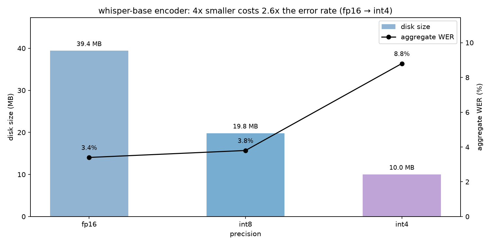
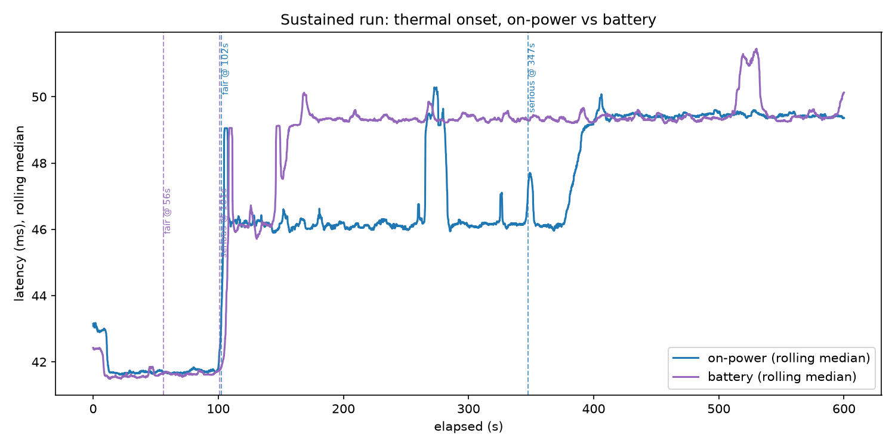
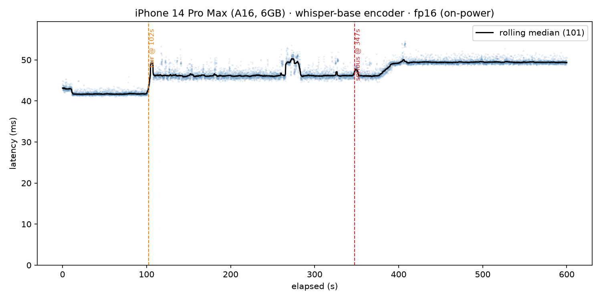
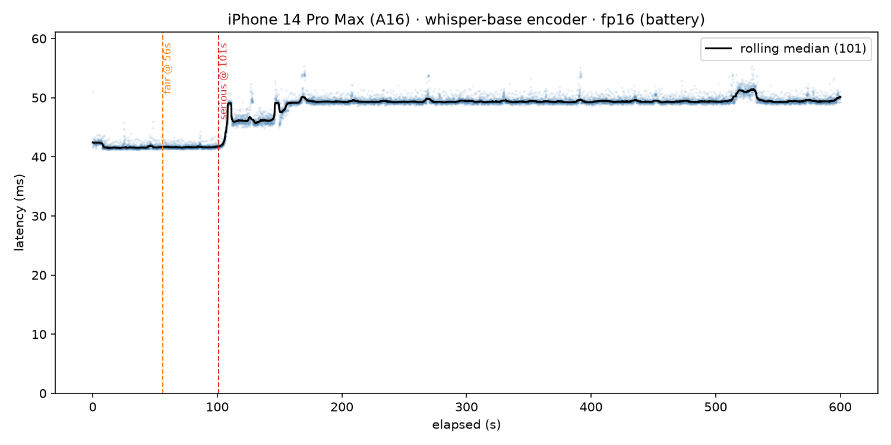
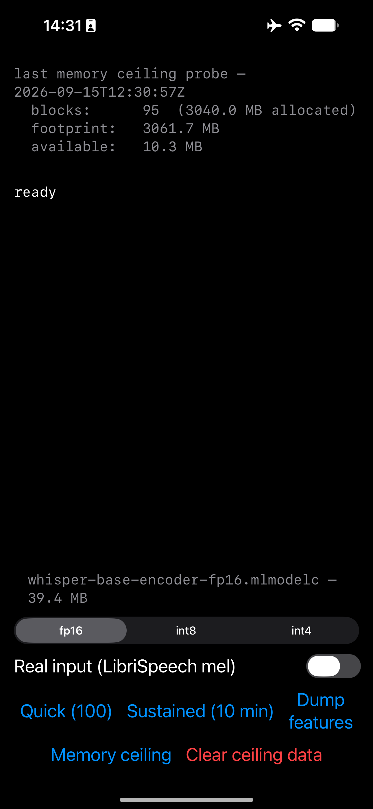

# Results

See [README.md](README.md) for what this project is and why.

Measured numbers, with the exact conditions that produced them. If a number
here can't be reproduced under the same conditions, treat it as wrong.

## Device & model

- Device: iPhone 14 Pro Max, A16 Bionic, 6GB RAM, iOS 27.0
- Model: whisper-base encoder, Core ML, fixed 30s input (`[1, 80, 3000]` mel).
  fp16 is the baseline precision throughout; int8 and int4 variants are
  also measured (sessions 5 and 7).

## Standard conditions

Unless a session notes otherwise, every run below was collected with:

- Airplane mode on
- Device off charger (not plugged in)
- Cooled 5 minutes before the run (no back-to-back thermal carryover)
- App launched fresh from the home screen (not resumed from Xcode)
- No debugger attached

Caveat: "cooled 5 minutes" is a fixed wall-clock wait, not a verified
thermal state. No session checks `thermalState` or device temperature
before starting a run, so a run could begin already partway into a
non-nominal state without anything here catching it.

Caveat: raw JSON written before `schema_version` 2 (no `schema_version`
key at all; see `RunFile` in `ios/BenchApp/BenchApp/Support.swift`) has
its `device` field and standing-conditions `notes` hardcoded as string
literals in the app, not read from the device at runtime. The two raw
`results/device-pull/*.json` files behind this document (sessions 3 and
4) predate that change. Both happen to have actually run on the iPhone
14 Pro Max named above, so their device label is correct by
coincidence, not verification, and their "airplane mode" note is an
assertion baked into that build, not a measurement. Any other
pre-`schema_version`-2 run, from any tester or device, would carry the
same hardcoded label and claim regardless of what was actually running
or what radios were on.

## Session 0: Core ML conversion

Converted the whisper-base encoder to Core ML fp16 on a MacBook M4 via
`coremltools`, verified against the PyTorch original (commit `01a840a`).

The commit log didn't record the verification numbers, so these are from
a reverification run on 2026-09-15, not the original 2026-09-04
conversion:

| Metric | Value |
|---|---|
| Output shape | (1, 1500, 512) |
| Max abs diff | 0.231567 |
| Mean abs diff | 0.002321 |
| Max rel diff | 0.009809 |

Note: `torch.jit.trace` freezes the input shape, so the converted model
accepts exactly 30s of audio and nothing else.

Caveat: verification uses a random dummy input, so these figures vary
slightly between runs. The original Sept 4 conversion is not recorded in
any file. Per this project's own conversation log (not a committed run),
it measured ~0.0083 max relative difference, consistent with the 0.009809
measured here, but that figure should be treated as anecdotal until a run
log exists for it.

## Session 1: first physical-device baseline

100 runs, airplane mode, off power (commit `005d46b`).

| Metric | Value |
|---|---|
| Load | 2046 ms |
| Steady-state median | ~42 ms |

Finding: establishes the warm-up convention used throughout this
document. Run 1 is discarded as warm-up, not more; runs 2-100 are
counted.

Caveat: no exact steady-state figure was ever recorded for this session.
This app version printed per-run timings without computing any
statistics, so ~42ms was estimated by inspection from the printed
output, not calculated. Median and percentile computation was added in
session 2.

Caveat: an earlier, non-standard-conditions measurement taken the prior
day on a charging phone read ~20% slower than this baseline.

## Session 2: memory instrumentation, cold vs. warm

`phys_footprint` sampled at 10ms intervals during inference; median/p95
computed over runs 2-100 (run 1 discarded as warm-up, per session 1).

| Metric | Cold install | Warm launch |
|---|---|---|
| Load | 1975 ms | 135 ms |
| Model cost (phys_footprint delta after load) | 8.2 MB | 2.9 MB |
| Peak footprint (during inference) | 28.4 MB | 20.6 MB |
| Median inference | 42.1 ms | 46.0 ms |
| p95 inference | 43.1 ms | 47.7 ms |

Notes:

- The `.mlpackage` is 39MB on disk but costs 6-9MB phys_footprint at load.
  Core ML memory-maps weights rather than copying them into the process's
  resident set.
- Warm model cost varies with page cache state: observed anywhere from
  0.1MB to 2.9MB across repeated warm launches, depending on how much of the
  mmap'd weight file the OS still has cached from prior runs.
- Unexplained: warm median (46.0ms) is higher than cold (42.1ms). This is
  backwards from what mmap/page-cache behavior would predict and needs
  rechecking, possibly a confound in how "warm launch" was triggered, or an
  artifact of sample size (100 runs, single session).

## Session 3: sustained run, thermal drift

Deviates from standard conditions: device was on charger (power), not off
charger. Additionally, screen was held on at minimum brightness with the
idle timer disabled for the full 600s duration of the run.

12,848 inferences over 600s, whisper-base encoder fp16, iPhone 14 Pro Max.
Raw data: `results/device-pull/sustained-1788785293.json`.

| Metric | Value |
|---|---|
| Load | 2082.9 ms |
| Model cost | 9.3 MB |
| Median (all runs) | 46.5 ms |
| p95 (all runs) | 50.1 ms |
| First-minute median | 41.8 ms |
| Last-minute median | 49.4 ms |
| Drift | +7.7 ms (+18%) |

Thermal state transitions (via `ProcessInfo.thermalState`):

| State | Onset |
|---|---|
| Nominal | 0.1 s |
| Fair | 102.4 s |
| Serious | 347.4 s |

Caveats:

- Run was on power, not battery. At the time, the assumption was that
  charging heat would pull the thermal transitions earlier than they'd
  occur on battery, making these onset times conservative (i.e.
  battery-only operation should do at least this well, possibly better).
  A battery rerun is pending. (It found the opposite: session 4 measured
  transitions arriving earlier on battery, not later. Session 8 then
  showed why the comparison didn't mean what it looked like: the actual
  latency cliff landed at ~102s in both runs regardless of power
  condition; only the reported `thermalState` timing differed.)
- The sustained summary does not discard the cold first inference the way
  the quick test does (see session 1). That inflates the first-minute
  median slightly, which means the true drift is understated relative to
  what's reported above.
- Screen was on at minimum brightness with the idle timer disabled for the
  full 600s, which contributes some heat on top of the inference workload
  itself.

### Accidental Low Power Mode measurement

Low Power Mode was on and the device was charging, not a clean isolation
of Low Power Mode alone. Needs a controlled rerun (LPM on/off, off charger,
otherwise standard conditions) before drawing conclusions.

| Metric | LPM + charging | Baseline |
|---|---|---|
| Median | 65.6 ms | 42 ms |
| Median delta | +56% | N/A |
| p95 | 85.4 ms | N/A |
| Load | 3376 ms | ~2000 ms |

## Session 4: sustained run, battery

Same protocol as session 3, but on battery (standard conditions: off
charger) instead of on power.

12,561 inferences over 600s, whisper-base encoder fp16, iPhone 14 Pro Max,
warm launch. Raw data: `results/device-pull/sustained-1788866056.json`.

| Metric | Value |
|---|---|
| Load | 137.9 ms |
| Model cost | 2.8 MB |
| Median (all runs) | 49.2 ms |
| p95 (all runs) | 50.7 ms |
| First-minute median | 41.6 ms |
| Last-minute median | 49.4 ms |
| Drift | +7.8 ms (+19%) |

Thermal state transitions (via `ProcessInfo.thermalState`):

| State | Onset |
|---|---|
| Fair | 56.2 s |
| Serious | 101.2 s |

### Comparison: session 4 (battery) vs. session 3 (power)

| Transition | Battery (session 4) | Power (session 3) |
|---|---|---|
| Fair | 56.2 s | 102.4 s |
| Serious | 101.2 s | 347.4 s |

Serious thermal state arrived 3.4x sooner on battery than on power, the
opposite of what charging heat would predict (session 3's caveats assumed
charging would pull transitions *earlier*, not later). Two candidate
explanations, both untested:

- Low battery level may make iOS more thermally conservative independent of
  actual heat (state-of-charge-driven throttling, not temperature-driven).
- The two runs may have started from different baseline temperatures
  (e.g. device history before the run, ambient conditions), confounding
  the comparison.
- Neither this run nor session 3 recorded starting battery charge level
  or ambient/device temperature, so neither hypothesis above could
  actually be tested from the data collected.

(Closed in session 8: the actual latency cliff landed at ~102s in both
runs regardless of power condition. The variance was in the reported
`thermalState`, not the hardware.)

Drift held at 18–19% across both runs (+18% on power, +19% on battery),
so the latency degradation itself is reproducible even though the thermal
transition timing is not: the two are not as tightly coupled as assumed.

The battery run also completed fewer inferences in the same 600s window
(12,561 vs. 12,848 on power), consistent with the earlier throttling
observed above.

## Session 5: precision comparison (fp16 / int8 / int4)

Quick test (100 runs), whisper-base encoder, iPhone 14 Pro Max. Airplane
mode, off power. Run 13:37–13:38.

| Metric | fp16 | int8 | int4 |
|---|---|---|---|
| Disk size | 39.4 MB | 19.8 MB | 10.0 MB |
| Load | 22.2 ms (warm) | 1425.2 ms (cold) | 1369.5 ms (cold) |
| Median inference | 41.8 ms | 41.1 ms | 40.5 ms |
| p95 inference | 43.3 ms | 42.2 ms | 41.2 ms |
| Peak footprint | 26.5 MB | 30.1 MB | 29.3 MB |

Finding: a 4x reduction in file size (fp16 → int4) buys only ~3% latency
improvement (41.8ms → 40.5ms median). At ~20M parameters the encoder is
likely compute-bound rather than memory-bandwidth-bound, so shrinking the
weights relieves no bottleneck. Practical guidance: quantize for storage
and download size, not for speed. Hypothesis to test later: this should
flip for a larger model, where memory bandwidth is more likely to be the
constraint.

Caveats:

- fp16 was measured on a warm load while int8 and int4 were cold. The run
  order was not controlled for this. Rerun all three from the same
  load state (or with cooling/reinstall between each) before trusting the
  load-time column or any cross-precision comparison that touches load.
- "Model cost" (phys_footprint delta at load: 1.6MB fp16, 7.9MB int8,
  6.9MB int4) bears no relation to file size and reflects page cache state
  rather than the model itself (see session 2). Dropped from the table
  above; report peak footprint instead.
- Conversion-time verification against PyTorch gave a max relative error of
  7.3% for int8, which exceeded the arbitrary threshold set in the
  conversion script. That threshold isn't meaningful as a correctness
  signal: the verification input was random noise, not a real spectrogram,
  and max relative difference is a worst-single-element metric that a
  handful of near-zero activations can blow up. Real accuracy numbers need
  word error rate on real audio, measured in session 7.
- Compute unit is fixed to `.all` (ANE/GPU/CPU together) in every run.
  No test here isolates which unit actually executes the quantized ops,
  so the compute-bound explanation above is inferred from the latency
  numbers, not confirmed with a layer trace (parked as future work in
  IDEAS.md).

## Session 6: input validity check (synthetic vs. real)

fp16 only, Quick test (100 runs), iPhone 14 Pro Max. Airplane mode, off
power. Both runs back to back at 10:30.

| Metric | Synthetic (`Float.random`) | Real (LibriSpeech mel, 6930-75918-0000) |
|---|---|---|
| Median | 43.0 ms | 42.9 ms |
| p95 | 44.2 ms | 43.8 ms |
| Min | 42.5 ms | 42.1 ms |
| Max | 44.8 ms | 47.1 ms |
| Peak footprint | 21.0 MB | 23.7 MB |

Finding: input distribution does not affect ANE throughput for this model.
The 0.1ms difference in median is well inside run-to-run variance. This
validates every latency number recorded since session 0: synthetic input
is a legitimate shortcut for timing work, now verified rather than assumed.

Scope the claim carefully: this holds for timing only. It says nothing
about quantization error, where activation distribution matters a great
deal. The 7.3% max relative error measured for int8 at conversion time
(session 5) used random noise and remains unverified against real audio,
settled in session 7 (aggregate WER 3.4% fp16, 3.8% int8, 8.8% int4).

Caveats:

- Tested on fp16 only, not int8 or int4.
- The real-input run showed run 1 (cold) at 69.6ms vs. 50.1ms for synthetic,
  likely first-read of the `.bin` from disk rather than inference. It's
  discarded from the statistics either way (see session 1 warm-up
  convention).
- `WhisperFeatureExtractor` pads clips shorter than 30s with silence, so if
  this utterance is short, a large fraction of the benchmarked compute was
  silence. Checked: median utterance duration was 6.27s, so 72.6% of each
  30s window was silence padding. This is why session 7 packs multiple
  utterances into each window instead, reaching 79.6% real audio.

## Session 7: quantization accuracy (WER on real audio)

Method: 20 LibriSpeech test-clean utterances packed into 7 windows of
~30s (79.6% real audio, 20.4% padding). Encoder ran on iPhone 14 Pro Max
at each precision; encoder outputs (`1, 1500, 512` float32) dumped to
disk, pulled to Mac, decoded with the full-precision PyTorch Whisper
decoder via `encoder_outputs=`. Scored with `jiwer` after normalization
(lowercase, strip punctuation, collapse whitespace, expand contractions).
Aggregate computed over total words, not averaged per window.

| Precision | Disk size | Median inference (session 5) | Aggregate WER |
|---|---|---|---|
| fp16 | 39.4 MB | 41.8 ms | 3.4% |
| int8 | 19.8 MB | 41.1 ms | 3.8% |
| int4 | 10.0 MB | 40.5 ms | 8.8% |

Per-window WER, fp16: 3.2 / 0.0 / 1.6 / 1.3 / 5.4 / 9.9 / 0.0 %.

Finding: int8 is close to free: half the size for 0.4 points of WER.
int4 is a bad trade: it buys only ~3% on latency (session 5) and costs
2.6x the error rate. On an ANE, 4-bit quantization of this model gives
up substantial accuracy in exchange for download size alone.

Caveats:

- Seven windows is a small sample, and window 5 alone was 9.9% at fp16.
  The aggregate is sensitive to individual windows. Expand to 50-100
  utterances before publishing.
- Only the encoder is quantized; the decoder ran at full precision in
  PyTorch. A fully quantized pipeline would likely be worse, so these
  numbers are optimistic relative to an on-device encoder+decoder setup.
- Packed multi-speaker windows are not standard LibriSpeech scoring, so
  absolute WER is not comparable to published Whisper figures; only the
  comparison between precisions here is valid.

## Session 8: charting the sustained runs, cliff not slope

Charted the two session 3/4 sustained runs from raw JSON.

Overlay: battery (session 4) and power (session 3) runs plotted together. Both show the same near-vertical latency step at ~102s despite different power conditions.

Session 3 (power), the on-charger run, showing the two-plateau shape.

Session 4 (battery), the off-charger run, stepping straight to one plateau.

Revised finding: the thermal degradation is a cliff, not a slope. Latency
holds flat at ~41.7ms until roughly 102 seconds, then steps near-vertically
to a plateau. The session 3/4 framing of "+18% drift over ten minutes" is
arithmetically accurate but misleading: it describes the run as a gradual
decline when the phone actually spends most of the ten minutes flat on a
plateau, with one sharp transition. Practical statement: you get about
100 seconds at full speed, then you're on a different machine.

Both runs step at almost exactly 102s despite different power conditions
(battery vs. on-charger), so the cliff location is a property of the
thermal envelope, not the power condition, a conclusion more robust than
either run alone supported.

This resolves the open thermal-timing caveat from session 4. There,
`ProcessInfo.thermalState` reported "serious" at 101s on battery vs. 347s
on power, a 3.4x difference that looked like it needed explaining. The
charts show the actual latency cliff landed in the same place (~102s)
both times. The variance was in the *reported* thermal state, not in the
hardware's actual behavior. `thermalState` is a poor predictor of actual
throttling and shouldn't be used to anticipate performance.

Secondary observations:

- The on-power run shows two plateaus: ~46ms for about four minutes, then
  a second step to ~49.4ms. The battery run skips the intermediate step
  and goes straight to ~49.5ms. Charging bought an intermediate step
  rather than a delay in reaching the same endpoint.
- The excursions around 270s and 520s (on-power run) appear in the scatter
  as dense bands of consecutive slow runs, not isolated outliers, i.e.
  sustained sub-plateaus, not noise.

Correction (session 10): "a cliff, not a slope" is an A16 result, not a
general property of thermal throttling on iOS. Session 10's cross-device
data (iPhone 17, A19) shows a smooth, monotonic creep under the same
protocol, with no step at all. Read this session's finding as specific
to the device it was measured on.

## Session 9: memory ceiling probe

iPhone 14 Pro Max (A16, 6GB), iOS 27.0. Airplane mode, off power, all
other apps closed. Allocated in 32MB blocks; progress fsync'd to disk
after each block since jetsam kills the process without warning.

| Run | Blocks | Allocated | Footprint at kill | Available at kill |
|---|---|---|---|---|
| 1 | 95 | 3040.0 MB | 3061.6 MB | 10.4 MB |
| 2 | 95 | 3040.0 MB | 3061.7 MB | 10.3 MB |
| 3 | 95 | 3040.0 MB | 3061.7 MB | 10.3 MB |

The app cannot report this itself at the moment of death, which is why progress is flushed to disk after every block.

Finding: the jetsam ceiling on a 6GB A16 is approximately 3060MB, half
the device RAM, not most of it. Three runs agreed to within 0.1MB, so
this is a fixed budget rather than something that drifts with system
pressure.

Second finding: `os_proc_available_memory()` is reliable. It counted down
to ~10MB and the kill landed there, with no phantom headroom reported.
Apps can budget against it directly.

Practical implication: with the whisper-base encoder fp16 costing ~8MB of
footprint (session 2), there is substantial headroom under this ceiling.
A 3B-parameter model at int8 would be roughly 3GB of weights and would sit
right at the limit.

Note: 3040MB allocated vs. 3061.7MB footprint. The ~21MB gap is the app
itself plus allocator overhead.

Caveat: this measures a foreground app aggressively allocating with
nothing else running and no response to memory warnings. Jetsam
prioritizes differently for apps that release memory under pressure, and
under system-wide memory pressure from other apps. Treat 3060MB as an
optimistic upper bound, not a guaranteed budget.

## Session 10: first external cross-device data (iPhone 17)

Contributed by a tester on an iPhone 17, A19, 8GB RAM (per Apple's spec
sheet, not read from the device), iOS 27.0. Two sustained runs,
whisper-base encoder fp16, 600s each. Deviates from standard conditions:
different tester, different hardware, and network state was not
deliberately controlled (see caveats).

### Run A: cooled start

21,295 inferences over 600s, synthetic input. Started 2026-09-23T08:23:16Z.
Raw data: `results/device-pull/sustained-fp16-1790151796.json`. Screenshot
of the on-screen summary: `results/screenshots/iphone17-run-a-summary.jpg`.

| Metric | Value |
|---|---|
| Load | 1510.4 ms (cold) |
| Available before load | 3363.5 MB |
| Model cost | 10.9 MB |
| Median (all runs) | 28.3 ms |
| p95 (all runs) | 30.2 ms |
| First-minute median | 26.11 ms |
| Last-minute median | 29.29 ms |
| Drift | +3.18 ms (+12.2%) |

| State | Onset |
|---|---|
| Nominal | at run start |
| Fair | 215.0 s |
| Serious | not reached |

### Run B: warm start

18,585 inferences over 600s. Started 2026-09-22T18:40:18Z, the evening
before run A. Raw data:
`results/device-pull/sustained-fp16-1790102418.json`.

| Metric | Value |
|---|---|
| Median (all runs) | 32.25 ms |
| p95 (all runs) | 38.87 ms |
| First-minute median | 26.61 ms |
| Last-minute median | 38.88 ms |
| Drift | +12.27 ms (+46.1%) |

Median and p95 computed from the raw samples here, the same way as
every other session (run 1 discarded as warm-up, per session 1's
convention); no on-screen summary or screenshot exists for this run, so
input mode (synthetic vs. real) and load time are unknown.

| State | Onset |
|---|---|
| Fair | at run start |
| Serious | 255.8 s |

Finding 1, revising session 8: the degradation shape is device-specific,
not just its magnitude. On the A16, latency holds flat and then steps
near-vertically at ~102s: session 8's "a cliff, not a slope." On the
A19, there is no step at all, a smooth, monotonic creep across the full
ten minutes. Session 8's finding is an A16 result and does not
generalise to other silicon.

Finding 2: starting thermal state moved the result nearly 4x on the same
device in the same day: +12.2% cooled (run A) versus +46.1% warm (run
B). That's a larger effect than the two-generation silicon gap between
the A16 and the A19. The five-minute cooldown in the standard conditions
is load-bearing, not hygiene.

Observation, untested: run A's on-screen summary (not the JSON, which
has no memory field) reported 3363.5MB available before load on the
iPhone 17, against session 9's ~3060MB jetsam ceiling on the 6GB A16. If
the 17 has 8GB, the jetsam ceiling is not scaling linearly with device
RAM: roughly +10% headroom for +33% more RAM. No ceiling probe (session
9's method) was run on this device, and "available before load" is not
the same measurement as session 9's "footprint at kill," so this is a
single unverified reading, not a measurement comparable to session 9.

Caveats:

- Both raw files are schema 1 (no `schema_version` key; see the
  schema-version caveat under Standard conditions above), so their
  `device` field reads "iPhone 14 Pro Max" and `notes` claims airplane
  mode. Neither is accurate. The device is known directly from the
  tester, not the file, and a screenshot of run A shows cellular and
  WiFi active, so airplane mode was off during that run. Neither run is
  a controlled isolation of the network variable, and run B's radio
  state is known only from the tester's report.
- Chip and RAM for the iPhone 17 are from Apple's public spec sheet, not
  read from the device.
- One tester, one device, two runs. This establishes that the cliff
  shape in session 8 is not universal; it does not establish what the
  A19's degradation curve looks like in general.
